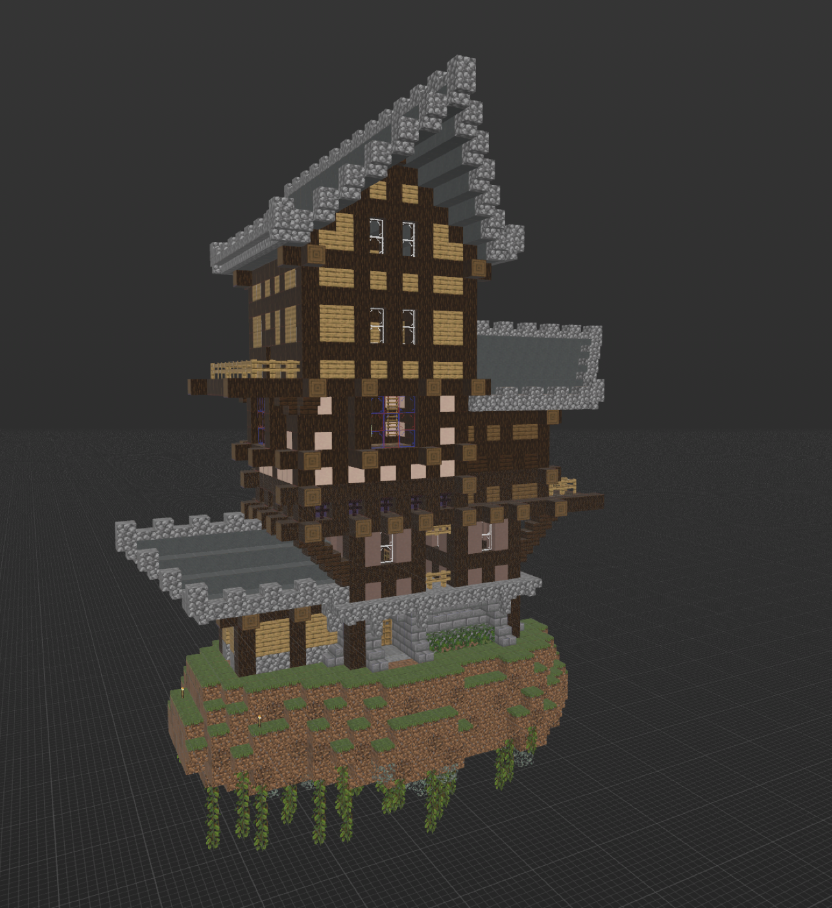
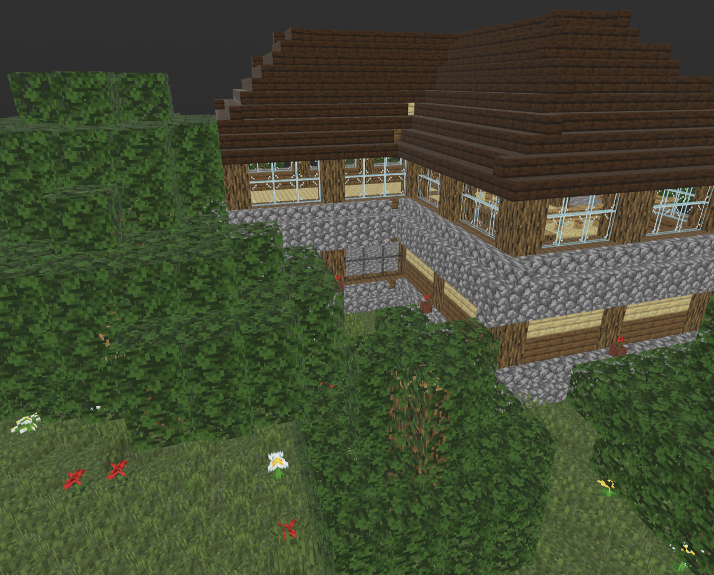

# structura-render

**Turn a Minecraft Structure NBT into a real photo or a 3D file — using
your own game's actual textures and block shapes, not guesses.**

No fake textures, no hardcoded block shapes, no bundled game files. Point
it at your own Minecraft client and get pixel-accurate PNGs and USDZ out
the other end.

<p>
  
  
</p>

## Why it's worth using

- **Real, not approximated.** Every texture pixel and every block shape
  comes straight from your own client — the same blockstate/model JSON and
  PNGs the game itself renders from. Doors, stairs, cross-plants, chests,
  glass — actual geometry, not a lookalike.
- **One mesh, every output.** Geometry is resolved once and shared between
  PNG renders and USDZ export, so what you preview is exactly what you get
  in 3D — nothing drifts between formats.
- **Clean by design.** Zero Mojang assets in this repo or its releases —
  can't, EULA forbids it. You always supply your own client, so there's no
  legal grey area to worry about.
- **Version-flexible.** Point it at a `.jar` from Minecraft 1.13 through
  the latest release and it just works — verified end to end on both
  1.21.1 and the newest 26.2. New blocks resolve automatically; no waiting
  on us to add support.
- **Light by default.** Core install is just NumPy, Pillow and SciPy.
  PyVista/USD only get pulled in if you actually ask for hero renders or
  USDZ export.
- **Self-updating classification.** Which blocks are solid cubes (for
  occlusion) is computed from real model geometry, not a hand-maintained
  name list — it doesn't go stale as new blocks ship.

## What it does

- **`block_model.py`** — generic blockstate/model resolver: variants,
  multipart, parent chains, per-face UV and rotation. Builds real geometry
  for the whole vanilla block set, not a per-block special case.
- **`textures.py`** — resolves `#variable` texture references and samples
  the real PNG, including per-pixel alpha for correct occlusion (glass,
  leaves, iron bars).
- **`projections.py`** — six-view orthographic PNGs (top/bottom/N/S/E/W)
  with envelope/aura/terrain-pod/glass-dome mask overlays, for engineering
  QA rather than looks.
- **`hero.py`** (`hero` extra) — one real-textured, real-lit PyVista render
  of the finished structure — the kind of shot above.
- **`usdz.py`** (`usdz` extra) — a textured 3D mesh for AR Quick Look or
  any USDZ viewer, from the same mesh builder as the hero renderer.
- **`build_full_cube_list.py` / `build_opaque_blocks.py`** — data-derived
  block classification, described above.

## Quick start

```bash
export STRUCTURA_MINECRAFT_ASSETS="$HOME/Library/Application Support/minecraft/versions/1.21.1/1.21.1.jar"
pip install 'git+https://github.com/kirimba1024/structura-core.git'
pip install -e '.[usdz]'
structura-render-hero structure.nbt preview.png
```

Point `STRUCTURA_MINECRAFT_ASSETS` at a client `.jar` (any version from
1.13 up) or an already-extracted `assets/minecraft` directory. A `.jar` is
extracted once into `$XDG_CACHE_HOME/structura-render/jar-assets`
(`~/.cache/...` if unset), keyed by its path, size and mtime, so repeat
runs and multiple installed versions don't re-extract or collide. When the
variable is unset, the package searches parent folders and the current
directory for `assets/minecraft`.

This project's own datapack targets Minecraft Java 1.21.1 specifically
(`structura_core.version.JAVA_VERSION`); if you're previewing *its*
structures, match that version for a guaranteed-correct result. Anything
older than 1.13 uses a different asset layout entirely (pre-"flattening")
and isn't supported. On load, the package checks for `heavy_core` (added
in 1.21) and warns on stderr if it's missing, as a cheap signal that the
pointed-at client predates 1.21 — not exhaustive, just a sanity check.

Use the lighter `hero` extra when USDZ export isn't needed; plain
projection rendering skips PyVista and OpenUSD entirely.
